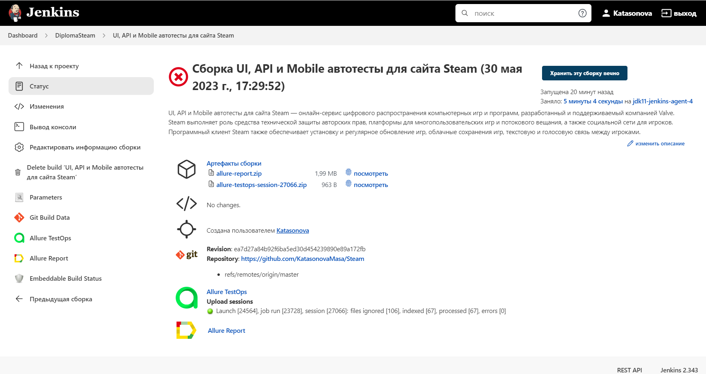
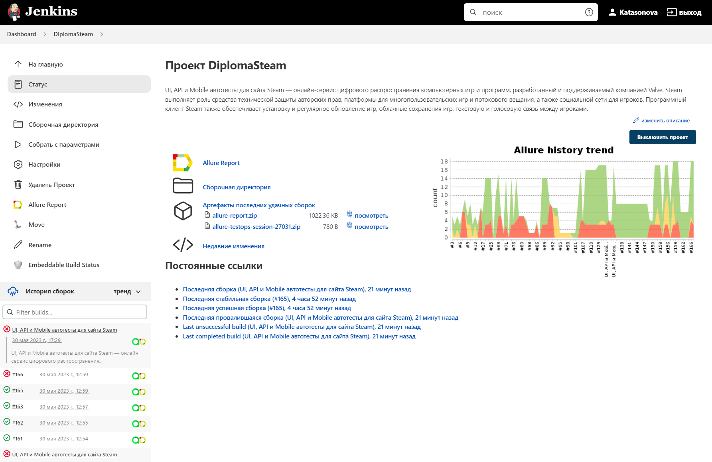
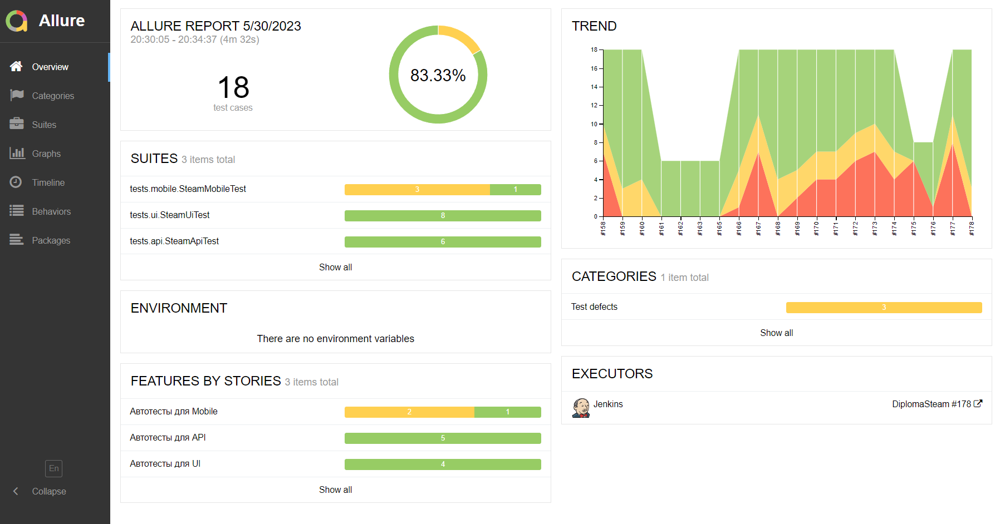
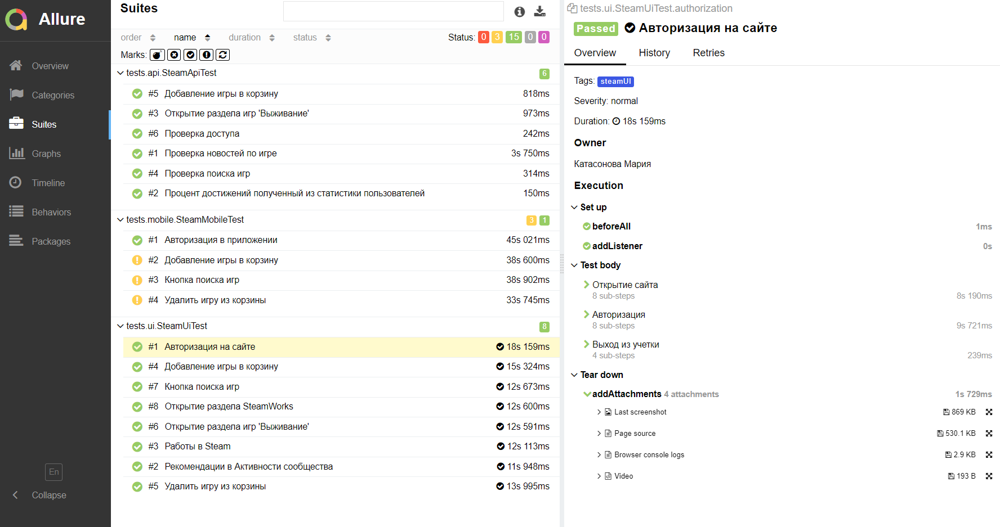
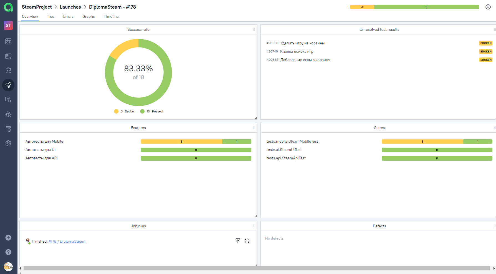
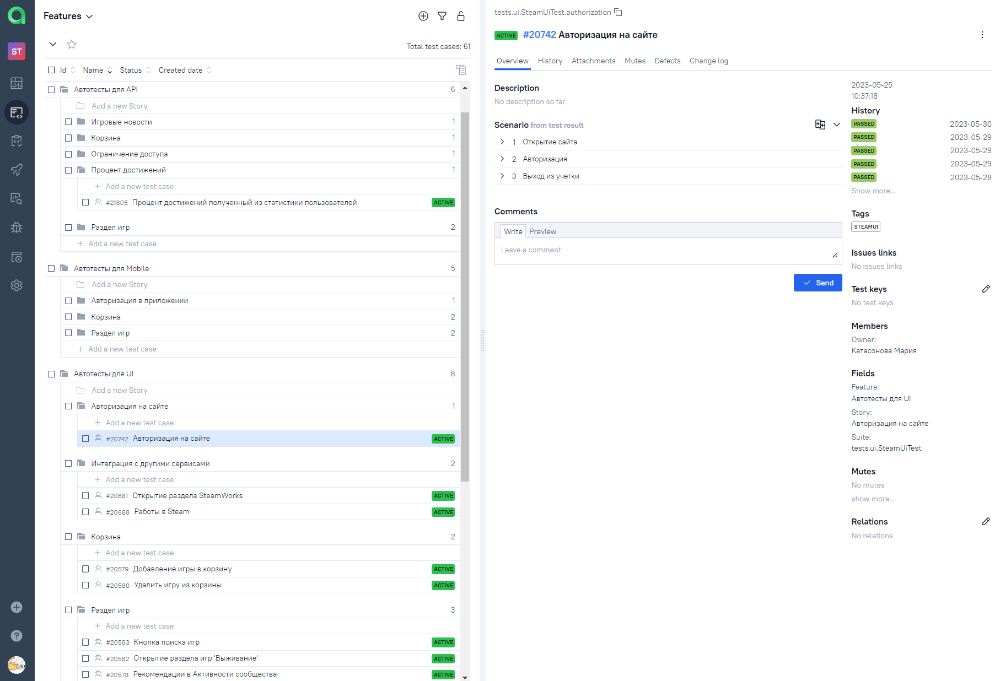
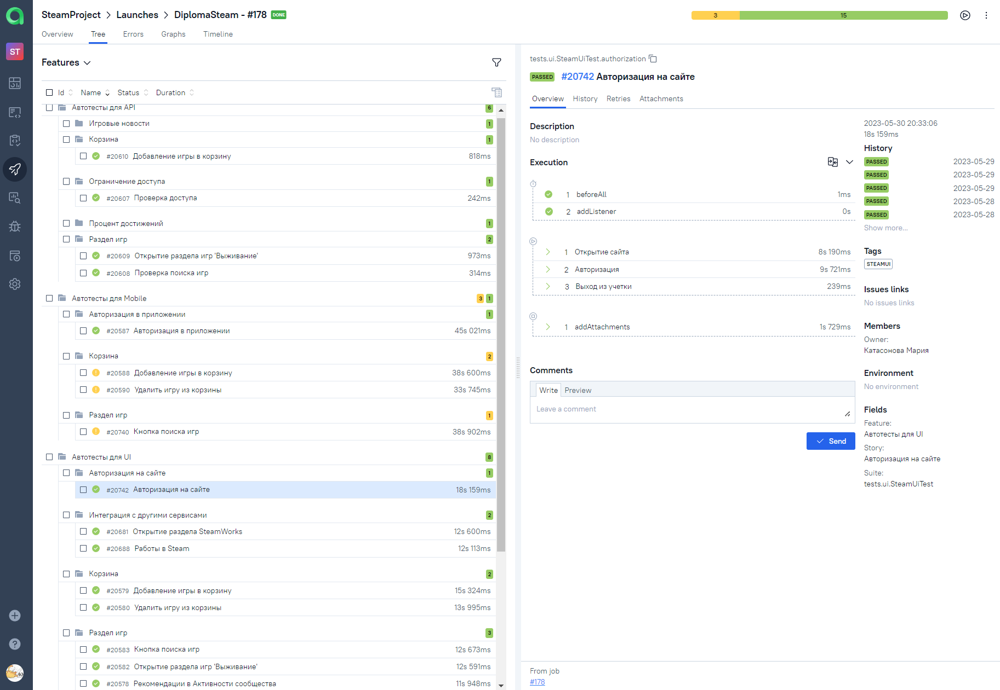
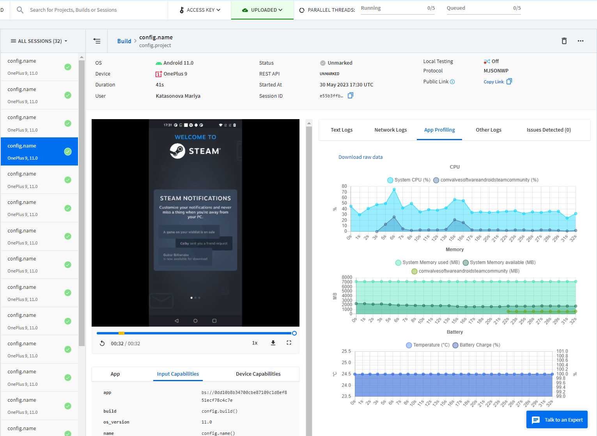
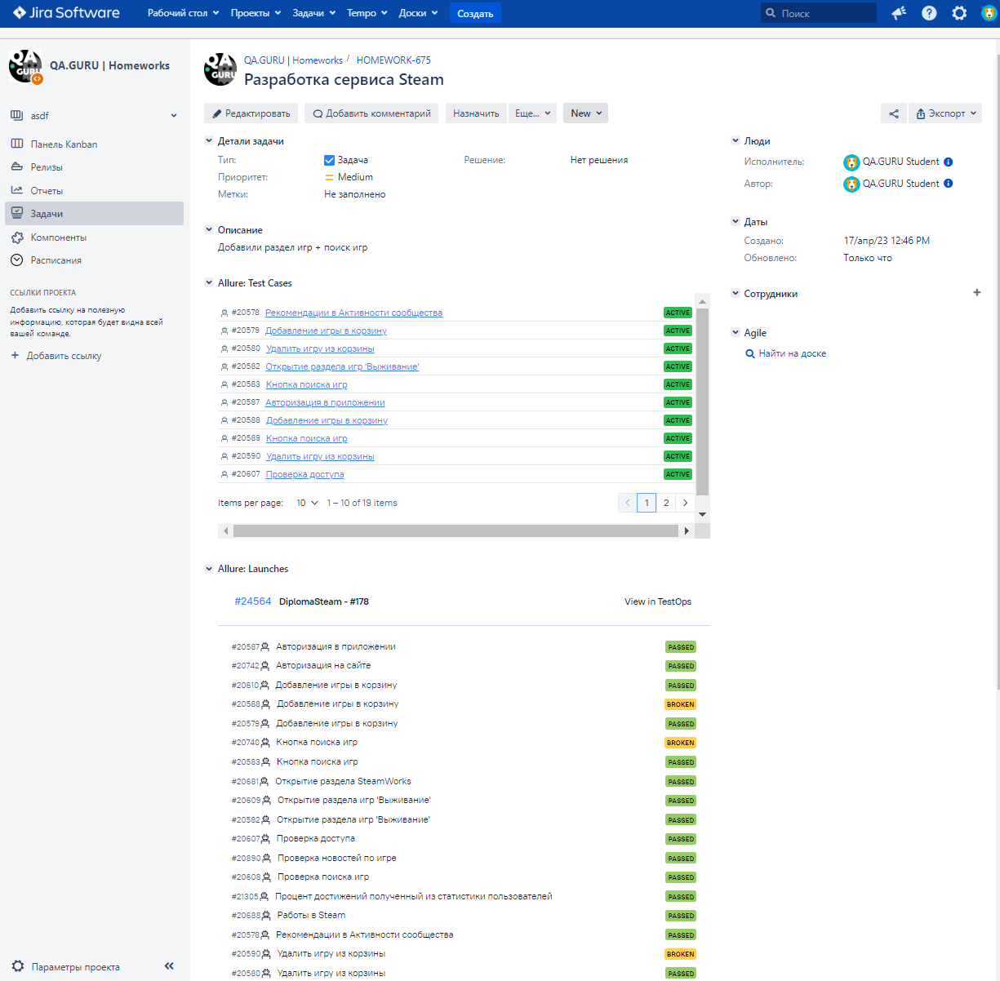
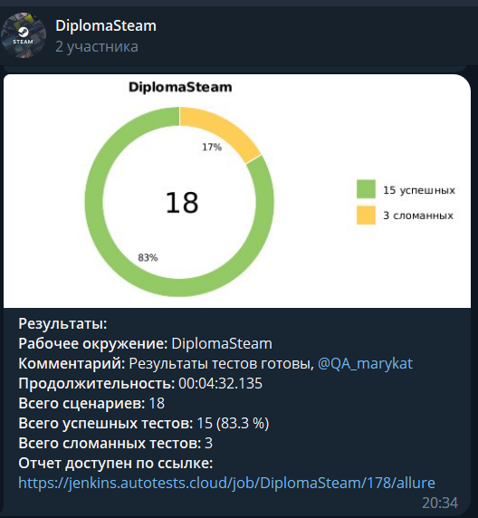

<h1>Добро пожаловать!</br> 
  Привет, я Мария </h1>
<h2>Я  QA Engineer (Junior Automation, Java):sunglasses:</h2>
<h2>Моё резюме на <a target="_blank" href="https://yoshkar-ola.hh.ru/resume/8bc9af15ff058d8cd60039ed1f617776426948">НН</h2>

<h2> :trophy:  Мои инструменты и технологии:</h2>

</br>

<details>
<summary>## :trophy:Мое образование:</summary>

||[kirt](https://kirt.usurt.ru/)| Бухгалтер (2007)|
|:-|:-|:-|
||[susu](https://www.susu.ru/ru)| Экономист (2011)|
||[volgatech](https://www.volgatech.net/)| Прикладная информатика (2022)|
||[qa.guru](https://qa.guru)| <h3>Automation QA Engineer (2023)</h3>|

</details>


[]

<h1>:star2: Мои сертификаты:</h1></a>

## </a> <a target="_blank" href="https://cert.software-testing.ru/319597675000365643">Chrome DevTools: Инструменты тестировщика (2022)</a>

## </a> <a target="_blank" href="http://cert.software-testing.ru/319115219954565708">Азбука IT (2021)</a>

## </a> <a target="_blank" href="https://testprovider.com/ru/search-certificate/tp19086679">Web Testing (2021)</a>

## </a> <a target="_blank" href="https://testprovider.com/ru/search-certificate/tp98295222">Web Testing automation on Java (2021)</a>


# <a target="_blank" href="https://github.com/KatasonovaMasa/DiplomaSteam">Дипломная работа выпускницы школы автотестирования "QA GURU"!

# UI, API и Mobile автотесты для сайта [STEAM](https://store.steampowered.com/) — онлайн-сервиса цифрового распространения компьютерных игр и программ, разработанного и поддерживаемого компанией Valve.


# <a name="TableOfContents">Содержание страницы</a>
+ [:trophy: Инструменты и технологии](#MyToolsAndTechnologies)
+ [Описаниe](#Description)
+ [Проект](#Project)
+ [:heavy_check_mark:  Реализованные проверки:](#ImplementedСhecks)  
  - <a href="#cases-ui"> UI
  - <a href="#cases-api"> API
  - <a href="#cases-mobile"> Mobile
+ [👷‍♂️ Сборка в Jenkins](#buildInJenkins)
    + [Страница сборки job в Jenkins](#buildInJenkins1)
    + [Главный экран со списком job в Jenkins](#buildInJenkins2)
+ [🖥 Параметры сборки в Jenkins](#terminal)
+ [:computer: Запуск из терминала](#Launch_from_terminal)
  - <a href="#console-ui"> UI
  - <a href="#console-api"> API
  - <a href="#console-mobile"> Mobile
+ [:chart_with_downwards_trend: Allure Report](#Allure_report)
    + [Главный экран отчета в Allure Report](#Allure_report1)
    + [Страница с проведенными тестами в Allure Report](#Allure_report2)
+ [:bar_chart: Интеграция с Allure TestOps](#Integration_Allure_TestOps)
    + [Экран с результатами запуска тестов](#Integration_Allure_TestOps1)
    + [Страница с тестами в TestOps](#Integration_Allure_TestOps2)
    + [Страница с тестами из Launches в Allure TestOps](#Integration_Allure_TestOps3)
+ [:bar_chart: Примеры сборок в Browserstack](#Integration_Brawserstack)
  + [Экран с результатами запуска тестов](#Integration_Brawserstack)
+ [:chart_with_upwards_trend: Интеграция с Jira](#Integration_Jira)
+ [Страница с задачей в Jira](#Page_Jira)
+ [:iphone: Отчет в Telegram](#Telegram)
+ [:movie_camera: Видео примеры прохождения тестов](#Video)
    + [Пример запуска тестов через selenoid](#Video1)
    + [Пример запуска тестов через Browserstack](#Video2)

<a name="MyToolsAndTechnologies"><h2>:trophy: Мои инструменты и технологии</h2></a>
<p  align="center">
  <a href="https://www.jetbrains.com/idea/"><code></code></a>
  <a href="https://www.java.com/"><code></code></a>
  <a href="https://selenide.org/"></a><code></code></a>
  <a href="https://aerokube.com/selenoid/"><code></code></a>
  <a href="https://gradle.org/"><code></code></a>
  <a href="https://junit.org/junit5/"><code></code></a>
  <a href="https://docs.qameta.io/allure/"><code></code></a>
  <a href="https://qameta.io/"><code></code></a>
  <a href="https://github.com/"><code></code></a>
  <a href="https://git-scm.com/"><code></code></a>
  <a href="https://www.jenkins.io/"><code></code></a>
  <a href="https://www.atlassian.com/ru/software/jira"><code></code></a>
  <a href="https://telegram.org/"><code></code></a>
  <a href="https://rest-assured.io/"><code></code></a>
  <a href="https://www.browserstack.com/"><code></code></a>
  <a href="https://appium.io/"><code></code></a>
  <a href="https://developer.android.com/studio"><code></code></a>
</p>

<a name="Description"><h2>Описаниe</h2></a>
Автотесты в этом проекте написаны на `Java` с использованием `Selenide`.\
`Gradle` - для автоматической системы сборки.  \
`JUnit5` - для модульного тестирования.\
`Jenkins` - CI/CD для удаленного запуска тестов.\
`Selenoid` - для удаленного запуска браузеров в `Docker` контейнере.\
`Allure Report` - для визуализации результатов тестирования.\
`Telegram Bot` - для уведомлений о результатах тестирования.\
`Allure TestOps` - система управления тестированием
`Rest Assured` - выполняет роль обёртки над http клиентом
`Appium` - используются для управления мобильным устройством с помощью веб драйвера
`Browserstack` - для удаленного запуска мобильных автотестов
`Android_Studio` - для эмулятора мобильного устройства и получения данных для подключения к apk
.

<a name="Project"><h2>Проект</h2></a>
<a href="https://store.steampowered.com/"><code></code></a> Проект по автоматизации тестирования для Steam, — онлайн-сервис цифрового распространения компьютерных игр и программ :star2:

<a name="ImplementedСhecks"><h2>:heavy_check_mark:  Реализованные проверки:</h2></a>
<a id="cases-ui"></a>UI-кейсы:

:heavy_check_mark: Авторизация на сайте</br>

:heavy_check_mark: Наличия раздела игр из категории 'Выживание'</br>

:heavy_check_mark: Наличие рекомендаций в Активности сообщества</br>

:heavy_check_mark: Поиск игр</br>

:heavy_check_mark: Добавление игры в корзину</br>

:heavy_check_mark: Удаление игры из корзину</br>

<a id="cases-api"></a>API-кейсы:

:heavy_check_mark: Открытие раздела игр из категории 'Выживание'</br>

:heavy_check_mark: Поиск игр</br>

:heavy_check_mark: Добавление игры в корзину</br>

:heavy_check_mark: Проверка доступа</br>

<a id="cases-mobile"></a>Mobile-кейсы:

:heavy_check_mark: Авторизация в приложении</br>

:heavy_check_mark: Поиск игр</br>

:heavy_check_mark: Добавление игры в корзину</br>

:heavy_check_mark: Удаление игры из корзину</br>


<a name="buildInJenkins" href="https://jenkins.autotests.cloud/job/SteamProject/"><h2>👷‍♂️ Сборки в [Jenkins](https://jenkins.autotests.cloud/job/Students/job/DiplomaSteam/)<h2></a>
- <a name="buildInJenkins1"><h5>Страница сборки job в [Jenkins](https://jenkins.autotests.cloud/job/Students/job/DiplomaSteam/178/)</h5></a>



- <a name="buildInJenkins2"><h5>Главный экран со списком job в [Jenkins](https://jenkins.autotests.cloud/job/Students/job/DiplomaSteam/)</h5></a>



<a name="terminal"><h2>:computer: Параметры сборки в Jenkins</h2></a>

Сборка в Jenkins

- BROWSER (браузер, по умолчанию chrome)

- BROWSER_VERSION (версия браузера, по умолчанию 100.0)

- BROWSER_SIZE (размер окна браузера, по умолчанию 2500х1080)

- BASEURL (какой адрес открывать для запуска тестов)

- SELENOID_URL (где запускать тесты)

- TASK (с какими тегами запускать тесты)


<a name="Launch_from_terminal"><h2>:computer: Запуск из терминала</h2></a>
### <a id="console-ui"></a>Локальный запуск UI-тестов

```
gradle clean steamUI
```

### <a id="console-api"></a>Локальный запуск API-тестов

```
gradle clean steamApi
```

### <a id="console-mobile"></a>Локальный запуск Mobile-тестов

```
gradle clean steamMobile
```

Удаленный запуск:

```
clean
${TASK}
-Dbrowser=${BROWSER}
-Dbrowser_version=${BROWSER_VERSION}
-Dbrowser_size=${BROWSER_SIZE}
-Dbaseurl=${BASEURL}
-Dselenoid_url=${SELENOID_URL}
```
<a name="Allure_report"><h2>:chart_with_downwards_trend: [Allure Report](https://jenkins.autotests.cloud/job/Students/job/DiplomaSteam/178/allure/)</h2></a>

- <a name="Allure_report1"><h3>Главный экран отчета в [Allure Report](https://jenkins.autotests.cloud/job/Students/job/DiplomaSteam/178/allure/#)</h3></a>



-  <a name="Allure_report2"><h3>Страница с проведенными тестами в [Allure Report](https://jenkins.autotests.cloud/job/Students/job/DiplomaSteam/178/allure/#suites/5c6961ccda11b989b711be0fa000af14/e117dc1bb946ebe9/)</h3></a>



<a name="Integration_Allure_TestOps"><h2>:bar_chart: Интеграция с [Allure TestOps](https://allure.autotests.cloud/launch/24564)</h2></a>

- <a name="Integration_Allure_TestOps1"><h3>Экран с результатами запуска тестов</h3></a>




- <a name="Integration_Allure_TestOps2"><h3>Страница с тестами в [TestOps](https://allure.autotests.cloud/project/2188/test-cases/20742?treeId=4235)</h3></a>



- <a name="Integration_Allure_TestOps3"><h3>Страница с тестами из Launches в [Allure TestOps](https://allure.autotests.cloud/launch/24564/tree/369247?treeId=4235)</h3></a>



<a name="Integration_Brawserstack"><h2>:bar_chart: Примеры сборок в [Browserstack](https://app-automate.browserstack.com/dashboard/v2/builds/a30dac4f7670d214d2a0cfda3716ec3a802ad3e2/sessions/e55b3ffbab9e70fd98626e7518989f663ab82f67)</h2></a>

- <a name="Integration_Brawserstack"><h3>Экран с результатами запуска тестов</h3></a>



 <a name="Integration_Jira"><h2>:chart_with_upwards_trend: Интеграция с [Jira](https://jira.autotests.cloud/browse/HOMEWORK-675)</h2></a>

- <a name="Page_Jira"><h3>Страница с задачей в [Jira](https://jira.autotests.cloud/browse/HOMEWORK-675)<h3></a>



<a name="Telegram"><h2>:iphone: Отчет в [Telegram](https://t.me/+wAG3zdRUXCxmNWNi)</h2></a>



<a name="Video"><h2>:movie_camera: Видео примеры прохождения тестов</h2></a>

- <a name="Video1"><h3>Пример запуска тестов через selenoid</h3></a>

https://github.com/KatasonovaMasa/Steam/assets/44576709/127ae60c-9c68-4e27-9f70-06c7aef69da7

- <a name="Video2"><h3>Пример запуска тестов через [Browserstack](https://app-automate.browserstack.com/dashboard/v2/builds/a30dac4f7670d214d2a0cfda3716ec3a802ad3e2/sessions/e55b3ffbab9e70fd98626e7518989f663ab82f67)</h3></a>

https://github.com/KatasonovaMasa/Steam/assets/44576709/35a05427-a8b1-4941-abc5-2cf98db8b66e


:heart: <a target="_blank" href="https://qa.guru">qa.guru</a><br/>

:blue_heart: <a target="_blank" href="https://t.me/qa_automation">t.me/qa_automation</a>


  

  
  

