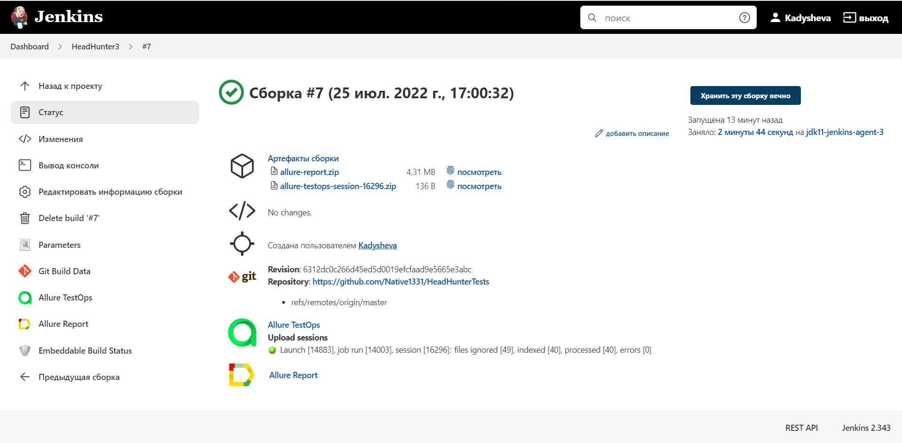
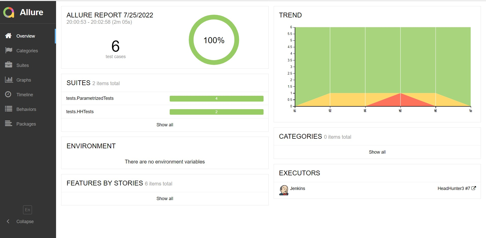
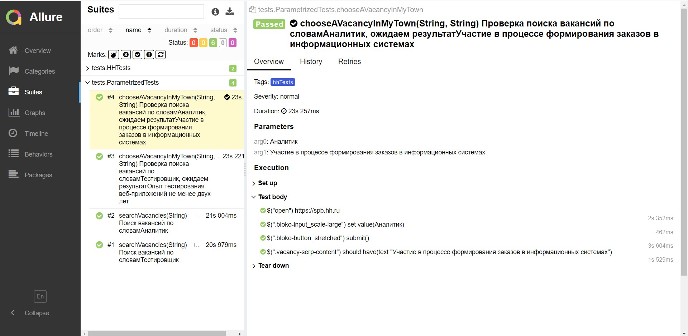
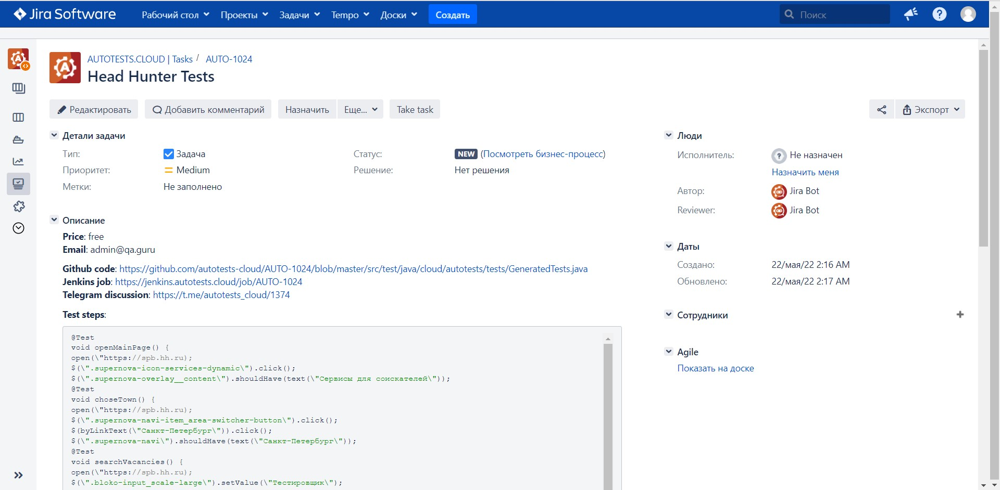
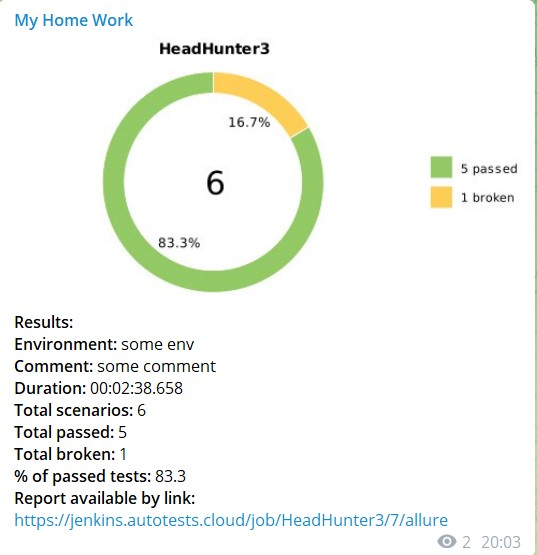

<h1>Добро пожаловать!</br> 
  Hi there, I'm Mariya </h1>
<h2>Im  QA Engineer:sunglasses:</h2>
<h2> :trophy:  My tools and technology:</h2>

</br>
## :trophy: My education:

||[RANHIGS](https://www.ranepa.ru/)| Manager (2007)|
|:-|:-|:-|
||[qa.guru](https://qa.guru)| <h3>Automation QA Engineer (2023)</h3>|


<h1>:star2: My certificates:</h1></a>
<a href="https://drive.google.com/file/d/12PQPcQSeRExTkMAkppkgnvdqhEJ23U5P/view?usp=sharing"><h2> QA Guru</h2></a>
<a href=""><h2> Software Testing</h2></a>


## Дипломная работа выпускницы школы автотестирования "QA GURU"! <a href="https://github.com/Native1331/HeadHunterTests">Ссылка на проект</a>

# Проект по автоматизации тестирования для  Head Hunter, сайта поиска работодателя и работника	:star2:
## <a target="_blank" href="https://spb.hh.ru/">Веб сайт Head Hunter</a>


## :clipboard:: Содержание:

- <a href="#trophy-технологии-и-инструменты">Технологии и инструменты</a>
- <a href="#heavy_check_mark-реализованные-проверки">Реализованные проверки</a>
- <a href="#clipboard_mark-сборка-в-Jenkins">Сборка в Jenkins</a>
- <a href="#computer-запуск-из-терминала">Запуск из терминала</a>
- <a href="#chart_with_downwards_trend-allure-отчет">Allure отчет</a>
- <a href="#bar_chart-интеграция-с-allure-testops">Интеграция с Allure TestOps</a>
- <a href="#chart_with_upwards_trend-интеграция-с-jira">Интеграция с Jira</a>
- <a href="#iphone-отчет-в-telegram">Отчет в Telegram</a>
- <a href="#movie_camera-видео-примеры-прохождения-тестов">Видео примеры прохождения тестов</a>

## :trophy:Технологии и инструменты

</br>

В данном проекте автотесты написаны на <code>Java</code> с использованием <code>Selenide</code> для UI-тестов.

В качестве библиотеки для модульного тестирования используется <code>JUnit 5</code>.

Для автоматизированной сборки проекта используется <code>Gradle</code>.

<code>Selenoid</code> выполняет запуск браузеров в контейнерах <code>Docker</code>.

<code>Allure Report</code> формирует отчет о запуске тестов.

<code>Jenkins</code> выполняет запуск тестов.

После завершения прогона отправляются уведомления с помощью бота в <code>Telegram</code>.


## 	:heavy_check_mark: Реализованные проверки</br>
Наличия раздела "Сервисы для соискателей" на главной странице</br>
Выбора города (на примере Санкт-Петербурга)</br>
Поиск вакансий "Тестировщик" и "Аналитик"</br>
Поиск вакансии "Тестировщик" и "Аналитик в городе Санкт-Петербурге</br>

## :clipboard: Сборка в Jenkins
### <a target="_blank" href="https://jenkins.autotests.cloud/job/HeadHunter3/">Сборка в Jenkins</a>




###  :clipboard: Параметры сборки в Jenkins:
Сборка в Jenkins

- browser (браузер, по умолчанию chrome)
- version (версия браузера, по умолчанию 99.0)
- size (размер окна браузера, по умолчанию 1920x1080)
- threads (количество потоков)
- необходимо добавить файл credentials.properties (содержащий в себе логины и пароли, пример в папке resources)

## :computer: Запуск из терминала
Локальный запуск:
```
gradle clean test
```

Удаленный запуск:
```
clean
test
-Dbrowser=${BROWSER}
-DbrowserVersion=${BROWSER_VERSION} 
-Dsize=${BROWSER_SIZE}
```

## :chart_with_downwards_trend: Allure отчет
- ### Главный экран отчета




- ### Страница с проведенными тестами



## :bar_chart: Интеграция с Allure TestOps
- ### Экран с результатами запуска тестов


- ### Страница с тестами в TestOps


## :chart_with_upwards_trend:	 Интеграция с Jira
- ### Страница с задачей в Jira




## 	:iphone: Отчет в Telegram




## :movie_camera: Видео примеры прохождения тестов


https://user-images.githubusercontent.com/83497921/180842190-123c8f3d-a1af-4363-aa5b-ef48283e3013.mp4


:heart: <a target="_blank" href="https://qa.guru">qa.guru</a><br/>
:blue_heart: <a target="_blank" href="https://t.me/qa_automation">t.me/qa_automation</a>


  

  
  
