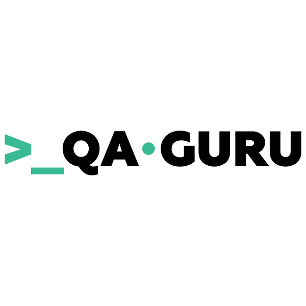

#### Добро пожаловать, я Мария 
#### Я  QA Engineer (Junior Automation, Java):sunglasses:
#### Моё резюме на <a target="_blank" href="https://yoshkar-ola.hh.ru/resume/8bc9af15ff058d8cd60039ed1f617776426948">НН
#### :trophy:  Мои инструменты и технологии:

 

:trophy:Мое образование:

||[kirt](https://kirt.usurt.ru/)| Бухгалтер (2007)|
|:-|:-|:-|
||[susu](https://www.susu.ru/ru)| Экономист (2011)|
||[volgatech](https://www.volgatech.net/)| Прикладная информатика (2022)|
||[qa.guru](https://qa.guru)| <h3>Automation QA Engineer (2023)</h3>|

:star2: Мои сертификаты:

## </a> <a target="_blank" href="https://cert.software-testing.ru/319597675000365643">Chrome DevTools: Инструменты тестировщика (2022)</a>

## </a> <a target="_blank" href="http://cert.software-testing.ru/319115219954565708">Азбука IT (2021)</a>

## </a> <a target="_blank" href="https://testprovider.com/ru/search-certificate/tp19086679">Web Testing (2021)</a>

## </a> <a target="_blank" href="https://testprovider.com/ru/search-certificate/tp98295222">Web Testing automation on Java (2021)</a>

Дипломная работа выпускницы школы автотестирования qa.guru <a target="_blank" href="https://qa.guru/"> 

Портфолио:

  

  
  

